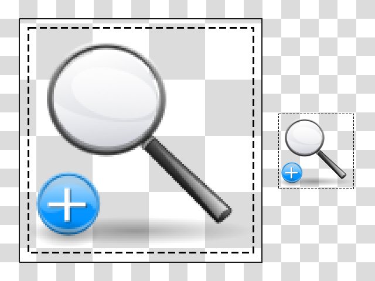

# Magnifiqus

[![CI]](https://github.com/qtilities/magnifiqus/actions/workflows/build.yml)

## Overview

Screen magnifier system tray tool;
once started, a floating window appears after clicking on the tray icon.

In the options you can set the visibility and size of the mouse cursor,
whether to run the application at startup, the background and border colors of the window
and if to keep it always on top. The zoom factor can be changed by using the mouse wheel
over the window, from 1 to 5 times.



## Dependencies

Runtime:

- Qt5/6 base
- X11Extras when using Qt5
- X11 libraries

Build:

- CMake
- Qt Linguist Tools
- [Qtilitools] CMake modules
- Git (optional, to pull latest VCS checkouts)

## Build

`CMAKE_BUILD_TYPE` is usually set to `Release`, though `None` might be a valid [alternative].<br>
`CMAKE_INSTALL_PREFIX` has to be set to `/usr` on most operating systems.<br>
Using `sudo make install` is discouraged, instead use the system package manager where possible.

```bash
cmake -B build -D CMAKE_BUILD_TYPE=Release -D CMAKE_INSTALL_PREFIX=/usr -W no-dev
cmake --build build --verbose
DESTDIR="$(pwd)/package" cmake --install build
```

## Packages

[![Packages]](https://repology.org/project/magnifiqus/versions)


[alternative]: https://wiki.archlinux.org/title/CMake_package_guidelines#Fixing_the_automatic_optimization_flag_override
[CI]:          https://github.com/qtilities/magnifiqus/actions/workflows/build.yml/badge.svg
[Packages]:    https://repology.org/badge/vertical-allrepos/magnifiqus.svg
[Qt]:          https://qt.io
[Qtilitools]:         https://github.com/qtilities/qtilitools/
